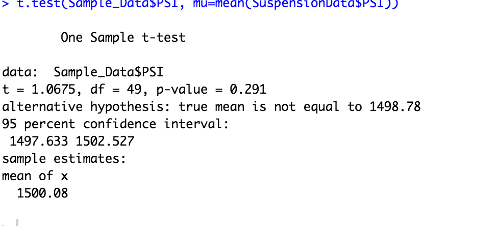
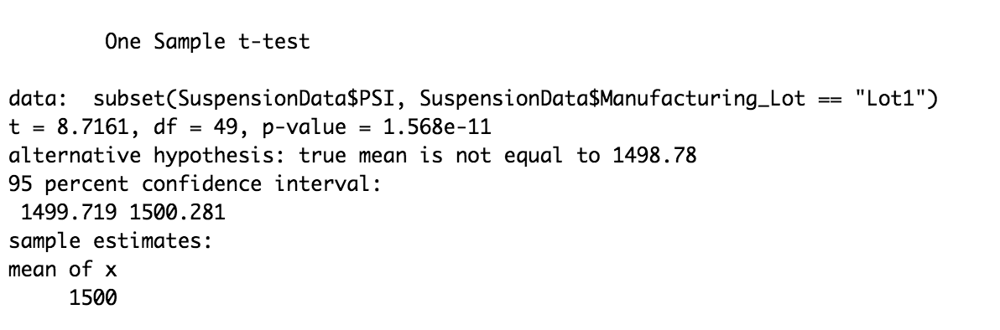
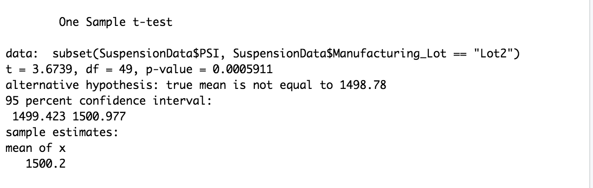
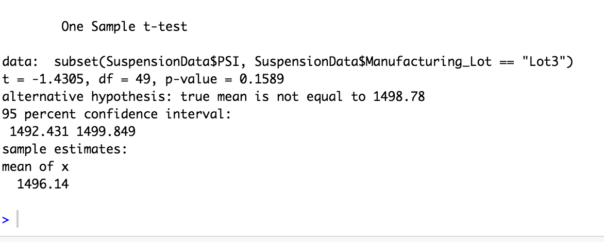

# MechaCar_Statistical_Analysis
## Linear Regression to Predict MPG
As shown in the photo below, our linear regression model predicts that vehicle length and ground clearance have significant impacts on MPG. In addition, our P-Value is well below our assumed significance level of 0.05%, therefore we can state that the slope of our line is not 0. This model is a somewhat accurate model of predicting MPG, as our R-Squared value is at 71%. This means that about 71% of the time, our model will correctly calcuate the mpg.
## Summary statistics on Suspension Coils
For this project we reviewed the summary statistics of the PSI in the suspesion coils for cars in three lots. The question that we were given is that if the variance per square inch for each vehicle is below 100, as that is what is mandated. As you can see, lot 1 and lot 2 do meet these requirements, but lot 3 does not. (Variance of 170 PSI)
## T-Tests on Suspension Coils
For this project we ran 4 T-Tests. The first one compared a random sample of vehicles' PSI to the population's average PSI. The results, as shown in this picture, demonstrate that we do not have enough evidence to reject the null hypothesis, as our P-Value is above our level of significance (95%).

The following three pictures adress each lot and their individal t.tests.
LOT 1

LOT 2

LOT 3

## Study Design: MechaCar vs Competition
To compare the MechaCar against the compeition, we would focus on three key metrics, MPG, Horespower, and safety rating. In order to ddo this we would take all avaialble data for each vehicle andd run a series of statistical tests. In order to see which vehicle was stronger in each category, we would run a one tailed t-test between a sample of the mechacar and the competition against the population of cars on the road. Our null hypothesis would be that the mechacar is the same or worse than the competition in each category. 
